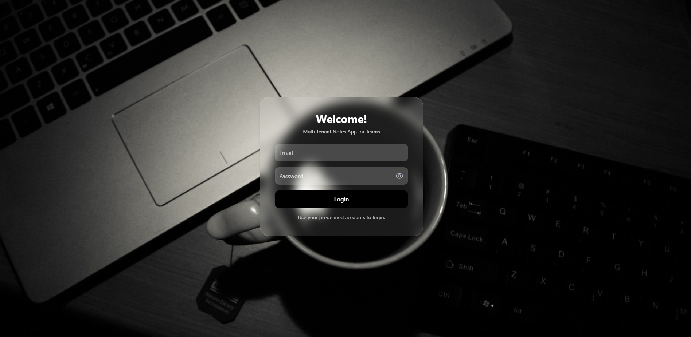

# SaaS Notes Application (Frontend)

This is the **frontend** for the SaaS Notes Application, built with **React** and **Tailwind CSS**, deployed on **Vercel**.

The frontend is fully **responsive** for **mobile, tablet, and desktop devices**.

---
## **Login Page Screenshot**



## **Live URLs**

| Service                | URL |
|------------------------|-----|
| **Frontend (Live App)** | [https://saas-frontend-git-main-anju-kumaris-projects-d57c2c52.vercel.app](https://saas-frontend-git-main-anju-kumaris-projects-d57c2c52.vercel.app) |
| **Backend API**         | [https://saas-git-main-anju-kumaris-projects-d57c2c52.vercel.app/api/v1](https://saas-git-main-anju-kumaris-projects-d57c2c52.vercel.app/api/v1) |

---

## **Features**

- Login using **pre-seeded test accounts**  
- Create, view, edit, and delete notes  
- Shows **"Upgrade to Pro"** message when Free tenant reaches 3 notes  
- Fully **responsive layout** for all devices  
- Built with **React + Tailwind CSS**  

---

## **Pre-Seeded Test Accounts**

| Tenant  | Email             | Password  | Role   |
|---------|-------------------|-----------|--------|
| Acme    | admin@acme.test   | password  | Admin  |
| Acme    | user@acme.test    | password  | Member |
| Globex  | admin@globex.test | password  | Admin  |
| Globex  | user@globex.test  | password  | Member |

> All accounts are pre-seeded; no registration endpoint is required.

---

## **Setup Instructions (Local)**

1. Clone the repo:
```bash
git clone https://github.com/logicscienc/saasFrontend.git
cd saasFrontend

# Install dependencies
npm install


# Create a .env file in the root
REACT_APP_BASE_URL=https://saas-git-main-anju-kumaris-projects-d57c2c52.vercel.app/api/v1

# Start the development server
npm start

